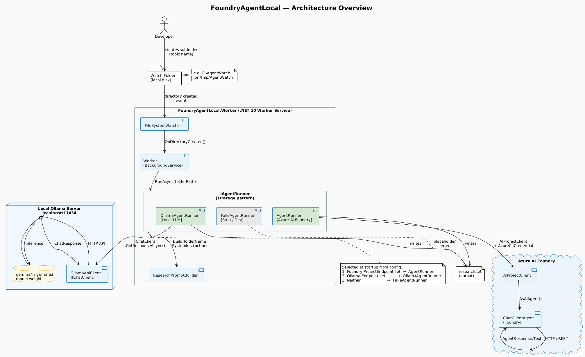
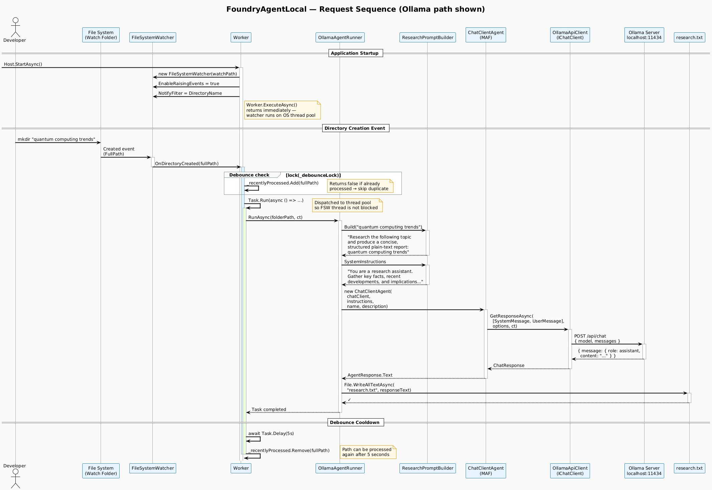
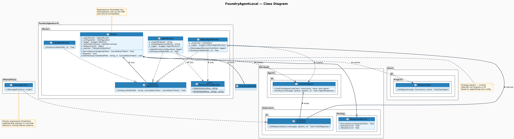

# Microsoft Agent Framework Demo — FoundryAgentLocal

A .NET 10 Worker Service that monitors a local folder for new subdirectory creation, runs an AI research agent on the folder name as a topic, and writes a structured plain-text report to `research.txt` inside the new folder.

The application supports three AI backends selected at startup from configuration — Azure AI Foundry, a local Ollama instance, or a stub for zero-infrastructure development — all behind a single `IAgentRunner` interface.

---

## Table of Contents

- [What Needs to Happen Next](#what-needs-to-happen-next)
- [How It Works](#how-it-works)
- [Architecture Overview](#architecture-overview)
- [Request Sequence](#request-sequence)
- [Class Structure](#class-structure)
- [Configuration](#configuration)
- [Running Locally](#running-locally)
- [Testing](#testing)
- [Project Structure](#project-structure)

---

## What Needs to Happen Next

The code builds, all unit tests pass, and the architecture is complete. What is **not** yet verified end-to-end is the AI inference call itself — that requires live infrastructure. Here is exactly what to do to make each path work.

---

### Path A — Local Ollama (fastest, no cloud account needed)

**1. Install Ollama**

Download and install from [ollama.com](https://ollama.com). Available for macOS, Windows, and Linux.

**2. Pull the model**

```sh
ollama pull gemma4
```

This downloads the model weights (~10–30 GB depending on the variant). The first pull takes several minutes. Verify it succeeded:

```sh
ollama list
# Should show gemma4 in the list
```

> **Tip:** If your machine does not have enough VRAM or RAM for `gemma4`, try a smaller model such as `gemma3:4b`, `phi4-mini`, or `llama3.2:3b` and update `Ollama:Model` accordingly.

**3. Confirm Ollama is running**

Ollama starts a local HTTP server on port 11434. Confirm it is reachable:

```sh
curl http://localhost:11434/api/tags
# Should return JSON listing available models
```

If the command fails, start Ollama manually:

```sh
ollama serve
```

**4. Create `appsettings.Development.json`**

Create this file at `src/FoundryAgentLocal.Worker/appsettings.Development.json` (it is gitignored — never committed):

```json
{
  "Ollama": {
    "Endpoint": "http://localhost:11434",
    "Model": "gemma4"
  },
  "WatchFolder": {
    "Path": "C:\\AgentWatch"
  }
}
```

On macOS/Linux use a Unix path for `WatchFolder:Path`, e.g. `"/tmp/AgentWatch"`.

**5. Run the worker**

```sh
cd src/FoundryAgentLocal.Worker
dotnet run
```

You should see:

```
info: FoundryAgentLocal.Worker.Worker[0]
      Watching for new folders in: C:\AgentWatch
```

**6. Trigger the agent**

Create a subdirectory inside the watch folder — the folder name becomes the research topic:

```sh
mkdir "C:\AgentWatch\quantum computing trends"
```

Within a few seconds `research.txt` will appear inside that folder containing the model's response.

**7. Run the full local validation script**

```powershell
.\build-local.ps1
```

This builds, runs unit tests, and runs the Ollama integration test end-to-end (see `build-local.ps1` at the repo root).

---

### Path B — Azure AI Foundry (requires Azure subscription)

**1. Create an Azure AI Foundry project**

1. Go to [ai.azure.com](https://ai.azure.com) and sign in.
2. Create a new **Hub** (or use an existing one), then create a **Project** inside it.
3. Note the **Project endpoint** — it looks like:
   ```
   https://<hub-name>.services.ai.azure.com/api/projects/<project-name>
   ```
   This is shown on the project overview page under **Project details**.

**2. Deploy a model**

1. Inside the project, go to **Models + endpoints** → **Deploy model**.
2. Deploy `gpt-4o-mini` (or any chat-completion model).
3. Note the **Deployment name** — this is what goes into `Foundry:ModelDeploymentName`.

**3. Assign yourself the correct RBAC role**

The app authenticates using `AzureCliCredential` (your local `az login` identity). Your Azure account needs the **Azure AI Developer** role on the Foundry project resource, or at minimum **Cognitive Services User** on the deployed model endpoint.

Assign in the Azure Portal under the project resource → **Access control (IAM)** → **Add role assignment**.

**4. Log in with the Azure CLI**

```sh
az login
az account set --subscription "<your-subscription-id>"
```

Verify the login resolves correctly:

```sh
az account show
```

**5. Create `appsettings.Development.json`**

```json
{
  "Foundry": {
    "ProjectEndpoint": "https://<hub-name>.services.ai.azure.com/api/projects/<project-name>",
    "ModelDeploymentName": "gpt-4o-mini"
  },
  "WatchFolder": {
    "Path": "C:\\AgentWatch"
  }
}
```

**6. Run the worker and trigger the agent**

```sh
cd src/FoundryAgentLocal.Worker
dotnet run
```

Create a subfolder in the watch path — `research.txt` will be written by the Azure-hosted model.

---

### Common First-Run Issues

| Symptom | Likely cause | Fix |
|---|---|---|
| Worker starts but no `research.txt` appears | Watch folder path mismatch | Confirm `WatchFolder:Path` matches the directory you are creating folders in |
| `research.txt` contains `[Fake research result...]` | Neither Foundry nor Ollama endpoint is configured | Check `appsettings.Development.json` exists and has a non-empty endpoint value |
| Ollama returns an error about the model | Model not pulled or name mismatch | Run `ollama list` and match the name exactly in config, e.g. `gemma4:27b` not `gemma4` |
| `AggregateException: No credential...` | Azure CLI not logged in or wrong subscription | Run `az login` and `az account set` |
| `403 Forbidden` from Azure | Missing RBAC role | Assign **Azure AI Developer** role to your identity on the Foundry project |
| `Connection refused` on Ollama | Ollama server not running | Run `ollama serve` in a separate terminal |
| Worker exits immediately | `WatchFolder:Path` config key missing | Ensure `appsettings.Development.json` is in `src/FoundryAgentLocal.Worker/` not the repo root |

---

## How It Works

1. The worker service starts and sets a `FileSystemWatcher` on a configured watch folder.
2. When a **new subdirectory** is created inside the watch folder, the event fires.
3. The folder name is treated as a research topic (e.g. a folder named `quantum computing trends` triggers a research report on that topic).
4. The configured `IAgentRunner` builds a structured prompt, calls the AI backend, and writes the response to `{newFolder}/research.txt`.
5. A debounce mechanism prevents the same folder from triggering duplicate runs within a 5-second window.

**Example:**

```
C:\AgentWatch\
└── quantum computing trends\     ← you create this folder
    └── research.txt               ← the worker writes this file
```

---

## Architecture Overview



The diagram shows the three major zones:

| Zone | Contents |
|---|---|
| **FoundryAgentLocal.Worker** | The .NET 10 Worker Service — `Worker`, `FileSystemWatcher`, the three `IAgentRunner` implementations, and `ResearchPromptBuilder` |
| **Azure AI Foundry** (cloud) | `AIProjectClient` + `ChatClientAgent` — used only when `Foundry:ProjectEndpoint` is configured |
| **Local Ollama Server** | `OllamaApiClient` communicating with a locally-running Ollama process — used when `Ollama:Endpoint` is configured |

### Runner Selection (Strategy Pattern)

`Program.cs` reads configuration at startup and registers exactly one `IAgentRunner` implementation with the DI container:

```
Foundry:ProjectEndpoint is set  →  AgentRunner        (Azure AI Foundry, gpt-4o-mini or custom model)
Ollama:Endpoint is set          →  OllamaAgentRunner  (local Ollama, e.g. gemma4)
neither                         →  FakeAgentRunner    (writes a placeholder — no AI required)
```

This means the same codebase runs in production against Azure, on a developer laptop against Ollama, and in a CI environment with no AI dependency at all.

---

## Request Sequence



The sequence diagram traces the full lifecycle of a single folder-creation event through the Ollama path (the Azure path is identical except `OllamaAgentRunner` and `OllamaApiClient` are replaced by `AgentRunner` and `AIProjectClient`):

1. **Developer creates a folder** — the OS notifies `FileSystemWatcher`.
2. **Debounce check** — a thread-safe `HashSet<string>` prevents the same path from being processed twice within 5 seconds (FSW can fire multiple events for one directory creation on some OS/drivers).
3. **`Task.Run` dispatch** — the agent is called on a thread-pool thread so the FSW callback thread is never blocked.
4. **Prompt construction** — `ResearchPromptBuilder` produces a system instruction string and a user message incorporating the folder name.
5. **`ChatClientAgent.RunAsync`** — the Microsoft Agents Framework wraps the `IChatClient` in a stateful agent loop and calls `GetResponseAsync` on the underlying `OllamaApiClient`.
6. **HTTP inference call** — `OllamaApiClient` POSTs to `localhost:11434/api/chat`; Ollama performs local inference and returns a `ChatResponse`.
7. **File write** — the response text is written to `research.txt` in the new folder.
8. **Cooldown** — after a 5-second delay the path is removed from the debounce set, allowing it to be processed again if re-created.

---

## Class Structure



### Core Classes

#### `Worker` (`BackgroundService`)
The hosted service entry point. Configures a `FileSystemWatcher` in `ExecuteAsync` (which returns immediately — the watcher runs on OS-managed threads). Owns the debounce state and dispatches agent runs via `Task.Run`.

#### `IAgentRunner`
Single-method interface:
```csharp
Task RunAsync(string folderPath, CancellationToken cancellationToken = default);
```
All three runner implementations share this contract, making them interchangeable in tests and at runtime.

#### `AgentRunner`
Uses `Azure.AI.Projects.AIProjectClient` authenticated with `AzureCliCredential` (Azure CLI login — no secrets in config). Calls `client.AsAIAgent()` from `Microsoft.Agents.AI.Foundry` to get a `ChatClientAgent`, then invokes `RunAsync` on it.

#### `OllamaAgentRunner`
Accepts an `IChatClient` (injected by DI from `OllamaApiClient`). Wraps it in a `ChatClientAgent` from `Microsoft.Agents.AI` and calls `RunAsync`. Because `IChatClient` is an interface, this class is fully unit-testable with Moq — no running Ollama required.

#### `FakeAgentRunner`
Writes a plaintext placeholder to `research.txt`. Used in CI and local development when neither Azure nor Ollama is configured. Zero external dependencies.

#### `ResearchPromptBuilder` (static)
Centralises all prompt text so it is shared identically across all three runner implementations:

- `Build(folderName)` → user message  
- `SystemInstructions` → system prompt injected into the agent

---

## Configuration

All configuration lives in `appsettings.json`. Sensitive overrides go in `appsettings.Development.json` (gitignored — never committed).

```json
{
  "Logging": {
    "LogLevel": {
      "Default": "Information",
      "Microsoft.Hosting.Lifetime": "Information"
    }
  },
  "Foundry": {
    "ProjectEndpoint": "",
    "ModelDeploymentName": "gpt-4o-mini"
  },
  "Ollama": {
    "Endpoint": "",
    "Model": "gemma4"
  },
  "WatchFolder": {
    "Path": "C:\\AgentWatch"
  }
}
```

| Key | Purpose |
|---|---|
| `Foundry:ProjectEndpoint` | Azure AI Foundry project URL. When non-empty, selects `AgentRunner`. |
| `Foundry:ModelDeploymentName` | Model deployment name in Foundry (default `gpt-4o-mini`). |
| `Ollama:Endpoint` | Base URL of the local Ollama server (e.g. `http://localhost:11434`). When non-empty (and Foundry is not set), selects `OllamaAgentRunner`. |
| `Ollama:Model` | Ollama model tag (default `gemma4`). Run `ollama pull gemma4` first. |
| `WatchFolder:Path` | Absolute path to the directory the worker monitors. Created automatically if it does not exist. |

### Example `appsettings.Development.json` for local Ollama

```json
{
  "Ollama": {
    "Endpoint": "http://localhost:11434",
    "Model": "gemma4"
  },
  "WatchFolder": {
    "Path": "C:\\AgentWatch"
  }
}
```

---

## Running Locally

### Prerequisites

- [.NET 10 SDK](https://dot.net)
- One of:
  - **Ollama** — install from [ollama.com](https://ollama.com), then `ollama pull gemma4`
  - **Azure CLI** — `az login` with access to an Azure AI Foundry project
  - Neither (runs in stub mode)

### Stub mode (no AI)

```powershell
cd src\FoundryAgentLocal.Worker
dotnet run
```

Folders created in `C:\AgentWatch` will get a placeholder `research.txt`.

### Ollama mode

1. Ensure Ollama is running: `ollama serve`
2. Pull the model: `ollama pull gemma4`
3. Create `src\FoundryAgentLocal.Worker\appsettings.Development.json`:

```json
{
  "Ollama": {
    "Endpoint": "http://localhost:11434",
    "Model": "gemma4"
  }
}
```

4. Run:

```powershell
cd src\FoundryAgentLocal.Worker
dotnet run
```

### Azure AI Foundry mode

1. Log in: `az login`
2. Create `appsettings.Development.json`:

```json
{
  "Foundry": {
    "ProjectEndpoint": "https://<your-project>.services.ai.azure.com/api/projects/<id>",
    "ModelDeploymentName": "gpt-4o-mini"
  }
}
```

3. Run:

```powershell
cd src\FoundryAgentLocal.Worker
dotnet run
```

### Local build script

`build-local.ps1` at the repo root automates the full validate-build-test cycle against a running Ollama instance:

```powershell
# Default: http://localhost:11434, model gemma4
.\build-local.ps1

# Custom model tag
.\build-local.ps1 -Model gemma4:27b

# Skip integration test
.\build-local.ps1 -SkipIntegration
```

The script: checks prerequisites → probes Ollama → writes `appsettings.Development.json` → `dotnet build` → unit tests → Ollama integration test (if available).

---

## Testing

```powershell
# All unit tests (no AI dependency)
dotnet test tests\FoundryAgentLocal.Tests --filter "Category!=Integration"

# Integration test (requires Ollama running with gemma4)
dotnet test tests\FoundryAgentLocal.Tests --filter "Category=Integration"
```

| Test class | What it covers |
|---|---|
| `WorkerTests` | `FileSystemWatcher` fires on directory creation; files are ignored; debounce works |
| `OllamaAgentRunnerTests` | Mocked `IChatClient` → `research.txt` written with correct content; messages non-empty |
| `AgentRunnerTests` | `FakeAgentRunner` writes file with folder name; `IAgentRunner` interface contract via Moq |
| `ResearchPromptBuilderTests` | Normal topics, empty/whitespace, special characters, system instructions non-empty |

CI runs all unit tests on every push and PR via GitHub Actions (`.github/workflows/ci.yml`).

---

## Project Structure

```
FoundryAgentLocal.sln
├── src/
│   └── FoundryAgentLocal.Worker/
│       ├── Program.cs                  # DI bootstrap + runner selection
│       ├── Worker.cs                   # BackgroundService + FileSystemWatcher
│       ├── IAgentRunner.cs             # Strategy interface
│       ├── AgentRunner.cs              # Azure AI Foundry implementation
│       ├── OllamaAgentRunner.cs        # Local Ollama implementation
│       ├── FakeAgentRunner.cs          # Stub implementation
│       ├── ResearchPromptBuilder.cs    # Shared prompt text
│       └── appsettings.json
├── tests/
│   └── FoundryAgentLocal.Tests/
│       ├── WorkerTests.cs
│       ├── OllamaAgentRunnerTests.cs
│       ├── AgentRunnerTests.cs
│       └── ResearchPromptBuilderTests.cs
├── docs/
│   ├── architecture-overview.png
│   ├── sequence-diagram.png
│   └── class-diagram.png
├── .github/
│   └── workflows/
│       └── ci.yml
└── build-local.ps1                     # Private local build + test script
```
